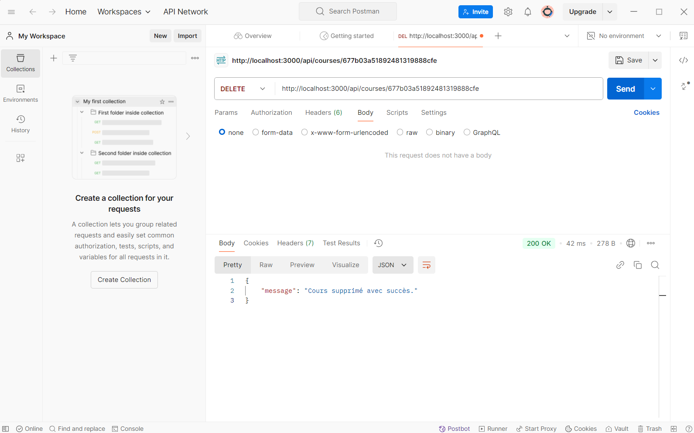

# Projet de fin de module NoSQL

Pour ce projet, vous allez créer une petite API qui va servir de backend à une plateforme d'apprentissage en ligne. J'ai préparé la structure du projet avec une organisation professionnelle du code, comme vous pouvez le constater dans ce dépôt Github.

### Les questions avec réponses :

**Question** : Pourquoi créer un module séparé pour les connexions aux bases de données ?

**Réponse** : Il est essentiel d'avoir un module dédié à la gestion des connexions aux bases de données afin d'éviter la duplication de code dans l'ensemble de l'application et de permettre sa réutilisation dans d'autres fichiers.

**Question** : Comment gérer proprement la fermeture des connexions ?

**Réponse** : Il est important d'ajouter une fonction pour fermer les connexions lorsque l'application se termine ou qu'une erreur se produit. Par exemple, pour MongoDB, on utilise `mongoClient.close()`, et pour Redis, `redisClient.quit()`.

**Question** : Pourquoi est-il important de valider les variables d'environnement au démarrage ?

**Réponse** : Il est important de valider les variables d'environnement au démarrage pour s'assurer que toutes les configurations nécessaires sont présentes avant que l'application ne démarre, ce qui permet de mieux gérer les erreurs et d'améliorer la résilience de l'application.

**Question** : Que se passe-t-il si une variable requise est manquante ?

**Réponse** : Si une variable requise est manquante, cela peut causer des problèmes comme des erreurs de connexion à la base de données, des pannes de l'API, ou même des plantages de l'application.

**Question** : Quelle est la différence entre un contrôleur et une route ?

**Réponse** : Une route définit l'URL (ou le chemin) de l'API et la méthode HTTP associée, puis dirige les requêtes vers le contrôleur approprié. Et un contrôleur contient la logique pour traiter les requêtes, récupérer les données et renvoyer une réponse au client.

**Question** : Pourquoi séparer la logique métier des routes ?

**Réponse** : Séparer la logique métier des routes permet de respecter le principe de séparation des responsabilités et d'avoir une organisation modulaire. Par exemple cela rend le code plus lisible et facile à comprendre, et la logique métier peut être réutilisée dans différents contrôleurs ou services sans duplication de code.

**Question** : Pourquoi séparer les routes dans différents fichiers ?

**Réponse** : Séparer les routes dans différents fichiers permet de mieux organiser l'application, d'éviter que le fichier des routes ne devienne trop volumineux et difficile à maintenir, et facilite l'ajout de nouvelles fonctionnalités sans perturber le reste de l'application.

**Question** : Comment organiser les routes de manière cohérente ?

**Réponse** : Pour organiser les routes de manière cohérente, il est important de : - Séparer par entité : Créer des fichiers de routes spécifiques à chaque entité. - Utiliser des préfixes : Ajouter des préfixes aux routes pour les regrouper par fonctionnalité. - Centraliser les routes : Regrouper toutes les routes dans un fichier central pour faciliter leur gestion et leur maintenance.

**Question** : Pourquoi créer des services séparés ?

**Réponse** : Créer des services séparés permet d'encapsuler la logique métier et d'isoler les interactions avec des composants externes (comme les bases de données ou les systèmes de cache).

**Question** : Comment gérer efficacement le cache avec Redis ?

**Réponse** : La gestion du cache avec Redis repose sur plusieurs principes clés pour optimiser la performance : - Expiration des clés (TTL) : Définir un temps d'expiration pour éviter les données obsolètes. - Eviction des clés : Utiliser des stratégies comme LRU pour supprimer les clés moins utilisées lorsque la mémoire est saturée. - Clé unique pour chaque élément : Assurer une clé unique pour chaque donnée, ce qui facilite son accès et sa gestion.

**Question** : Quelles sont les bonnes pratiques pour les clés Redis ?

**Réponse** : Les bonnes pratiques pour les clés Redis incluent l’utilisation de clés descriptives, l’ajout de préfixes (namespace) pour éviter les collisions, et la création de clés courtes pour limiter la surcharge. Il est également recommandé de stocker des valeurs simples et de définir une expiration pour les données mises en cache, sauf si elles sont permanentes.

**Question** : Comment organiser le point d'entrée de l'application ?

**Réponse** : Le point d'entrée d'une application initialise et démarre l'application en configurant les connexions, les middlewares, les routes, et le serveur. Pour une bonne organisation, il est essentiel de séparer les préoccupations en plaçant les configurations complexes dans des fichiers séparés. Le démarrage du serveur doit être asynchrone pour garantir que toutes les connexions nécessaires sont établies avant d'accepter des requêtes. Enfin, la gestion des erreurs doit être claire, par exemple, en évitant de démarrer le serveur si la connexion à la base de données échoue.

**Question** : Quelle est la meilleure façon de gérer le démarrage de l'application ?

**Réponse** : La gestion du démarrage de l'application peut être optimisée en suivant ces bonnes pratiques : assurez-vous que toutes les connexions aux bases de données et services externes (comme Redis) sont établies avant de démarrer le serveur, en utilisant async/await pour attendre leur réussite. Le démarrage du serveur doit être asynchrone, permettant de lancer les connexions avant de commencer à accepter les requêtes. Enfin, il est crucial de gérer les erreurs de démarrage en empêchant le serveur de démarrer si une connexion échoue, avec un message d'erreur explicite.

**Question** : Quelles sont les informations sensibles à ne jamais commiter ?

**Réponse** : Ne commitez jamais d'informations sensibles telles que les identifiants de base de données (URI, noms d'utilisateur, mots de passe), les clés d'API, les jetons d'authentification, les configurations serveur (ports, chemins sensibles) ou des données personnelles/critiques (e-mails, mots de passe par défaut, informations privées).

**Question** : Pourquoi utiliser des variables d'environnement ?

**Réponse** : Les variables d'environnement offrent des avantages clés : elles protègent les données sensibles en les gardant hors du code source, permettent de configurer facilement différents environnements (développement, test, production), facilitent la maintenance sans modifier le code, et favorisent une collaboration sécurisée entre développeurs.

### Configuration et Exécution du Projet en Local

**1. Cloner le dépôt**

git clone https://github.com/salmaabakil/learning-platform-template  
cd learning-platform-template 

**2. Installer les dépendances**

npm install  

**3. Démarrer les services nécessaires**

Base de données MongoDB : mongod  
Serveur Redis : redis-server  

### Structure du projet

Le projet est organisé de manière modulaire pour faciliter la lisibilité, la maintenance et l'évolutivité. Voici une vue d'ensemble de la structure :

**src/config :**

db.js : Contient la logique pour se connecter à la base MongoDB et Redis.

env.js : Gère le chargement des variables d'environnement à partir du fichier .env.

**src/controllers :**

courseController.js : Gère la logique métier pour les cours, comme la création,la modification et la suppression.

**src/routes :**

courseRoutes.js : Définit les endpoints pour interagir avec les cours.

**src/services :**

mongoService.js : Fournit des fonctions pour interagir avec MongoDB.

redisService.js : Fournit des fonctions pour utiliser Redis comme système de cache.

**src/app.js :**
Point d'entrée principal qui initialise le serveur, configure les middlewares et monte les routes.

**.env :**
Contient les informations sensibles (URI de la base de données, clés API, etc.) qui ne doivent pas être exposées dans le code source.

**package.json :**
Décrit les dépendances nécessaires au projet et fournit des scripts pour le développement et le déploiement.

### Choix et Utilisation de Postman pour Tester l'API
Le choix technique que j'ai effectué pour tester et interagir avec l'API est Postman. Cet outil est particulièrement adapté pour l'automatisation des tests d'API grâce à son interface graphique intuitive et à ses nombreuses fonctionnalités avancées. Il permet de simuler facilement des requêtes HTTP, d'inspecter les réponses et de vérifier la conformité des données retournées par l'API.

Dans le cadre de mon projet, j'ai exécuté trois types de requêtes HTTP : POST, GET et DELETE.
La requête POST a été utilisée pour envoyer des données à l'API et créer des ressources sur le serveur.
La requête GET m'a permis de récupérer les informations stockées sur le serveur.
Enfin, la requête DELETE a permis de supprimer une ressource spécifique en fonction de son identifiant (ID).
Ces opérations m'ont permis de vérifier le bon fonctionnement de l'API et de m'assurer que la gestion des ressources (création, récupération, suppression) est correctement implémentée.

L'utilisation de Postman m'a également permis de tester les différents scénarios de manière efficace et de valider les bonnes pratiques en termes de structure des requêtes et gestion des réponses. Cela a renforcé la robustesse et la fiabilité de l'API avant son déploiement.

